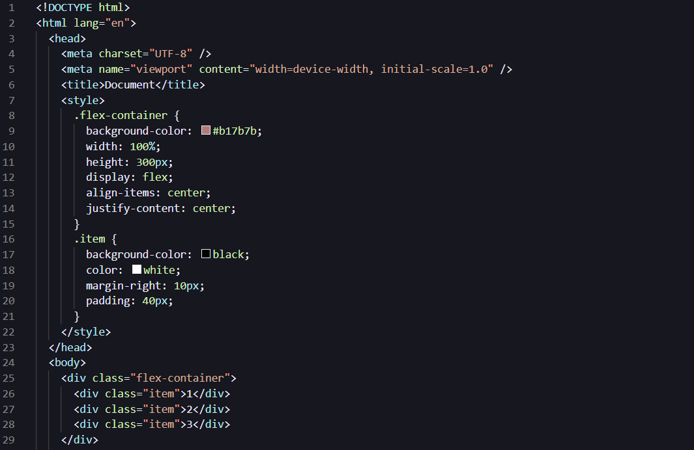

# Da Theme by Kavindu

### Reason behind the creation of <strong>Da Theme</strong>.

I always prefer **Dark Themes**. One thing I didn't like much in the existing themes that I wanted to use was the use of some color combination. specially using 'red' for some of the syntax.

I personally don't feel confortable with the use of red color in the code base for anything other than errors.

So, I decided to give creating my own theme a shot, and here it is.

You might have the same issue that I had with the existing themes. Here is my solution for you. Give it a try and **Enjoy**.

And I should say, I was inspired by the [GitHub Theme](https://marketplace.visualstudio.com/items?itemName=GitHub.github-vscode-theme) and the default VS Dark theme for the creation of this theme.

I will continue to update this😊. Thank you❤️

### Screenshots

**Happy Coding..!**
